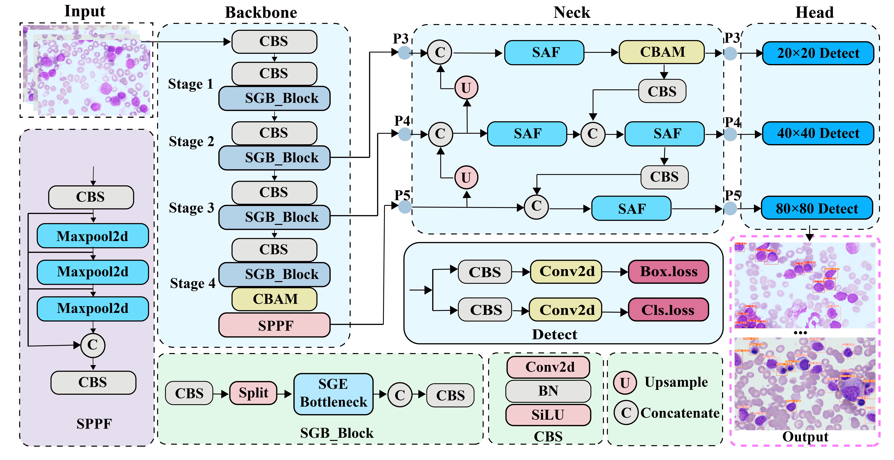
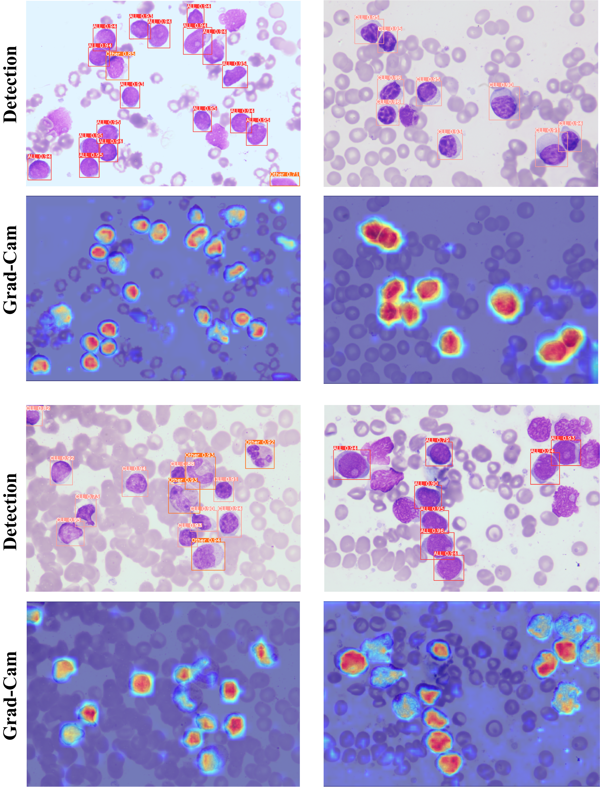

<h2 align="center">High-efficiency spatially guided learning network for lymphoblastic leukemia detection in bone marrow microscopy images</h2>

<p align="center">
  Liye Mei<sup>1,2,3</sup>, Chentao Lian<sup>1,2,*</sup>, Suyang Han<sup>3</sup>, Zhaoyi Ye<sup>2,4</sup>, Yuyang Hua<sup>1</sup>, Meixing Sun<sup>1</sup>, Jing He<sup>5</sup>, Zhiwei Ye<sup>1,2</sup>, Mengqing Mei<sup>1</sup>, Yaxiaer   Yalikun<sup>6</sup>, Hui Shen<sup>5</sup>, Cheng Lei<sup>2,7</sup>, Bei Xiong<sup>5</sup>
</p>

<p align="center">
  <sup>1</sup> School of Computer Science, Hubei University of Technology, Wuhan, 430068, China<br>
  <sup>2</sup> The Institute of Technological Sciences, Wuhan University, Wuhan, 430072, China<br>
  <sup>3</sup> The Second Clinical School of Wuhan University, Zhongnan Hospital of Wuhan University, Wuhan, 430071, China<br>
  <sup>4</sup> Electronic Information School, Wuhan University, Wuhan, 430072, China<br>
  <sup>5</sup> Department of Hematology, Zhongnan Hospital of Wuhan University, Wuhan, 430071, China<br>
  <sup>6</sup> Division of Materials Science, Nara Institute of Science and Technology, Ikoma, Nara, 630-0192, Japan<br>
  <sup>7</sup> Shenzhen Institute of Wuhan University, Shenzhen, 518057, China<br>
  Corresponding author: Hui Shen (<a href="shenhui@znhospital.cn" target="_blank">shenhui@znhospital.cn</a>); 
  Bei Xiong (<a href="zn001587@whu.edu.cn" target="_blank">zn001587@whu.edu.cn</a>);
</p>

## Overview

<div>
    
</div>

**Figure 1. The framework of the proposed model.**

**_Abstract -_** Leukemia is a hematologic tumor that proliferates in bone marrow and seriously affects the survival of patients. Early and accurate diagnosis is crucial for effective leukemia treatment. Traditional diagnostic methods rely on experts’ subjective analysis of bone marrow smears microscopic images. This approach is time-consuming and complex. Despite recent advances in deep learning, automated leukemia detection remains limited due to the scarcity of high-quality datasets, the prevailing focus on single-cell image classification rather than precise cell-level detection in whole slide images, along with challenges such as morphological heterogeneity, uneven staining, scale variation, and occluded cell boundary in bone marrow smears. To address these challenges, we construct a novel dataset comprising 1794 high-quality microscopic images, establishing a new benchmark for lymphocytic leukemia detection. Additionally, we develop a fully automated diagnostic method based on spatially-guided learning (SGLNet), enabling rapid whole slide analysis of leukemia. Specifically, we introduce several innovative enhancements to the baseline algorithm, including the spatially-guided learning framework, scale-aware fusion module, small object-enhancing mechanisms, and efficient intersection over union loss function. These improvements effectively address the impact of morphological similarity and complex backgrounds in leukemia detection, significantly enhancing detection accuracy. Finally, the results show that SGLNet achieves mean average precision scores of 95.9 % and 98.6 % in detecting acute lymphoblastic leukemia and chronic lymphocytic leukemia, respectively. These results demonstrate the efficiency and accuracy of our method in identifying lymphoblastic leukemia cells, significantly enhancing large-scale clinical diagnosis, and supporting clinicians in developing personalized treatment plans.


## Requirements

```python
pip install -r requirements.txt
```

## Train

### 1. Prepare training data 

- The dataset is available upon reasonable request. Please contact the  author for access.
```python
SGLNet
├── LLD-2024
│   ├── images
│   │   ├── train
│   │   │   ├── 1.jpg
│   │   │   ├── 2.jpg
│   │   │   ├── .....
│   │   ├── val
│   │   ├── test
│   ├── labels
│   │   ├── train
│   │   │   ├── 1.txt
│   │   │   ├── 2.txt
│   │   │   ├── .....
│   │   ├── val
│   │   ├── test
```
- After downloading the data set, modify the paths in path, train, val and test in the [data.yaml](data.yaml) file.


### 2. Begin to train
```python
python train.py
```


## Test

### 1. Begin to test
```python
python val.py
```

## Results

| **Methods** | **mAP** | **Precision** | **Recall** | **GFLOPs** ↓ | **Params (M)** ↓ | **FPS** |
|:-----------:|:-------:|:-------------:|:----------:|:-------------:|:----------------:|:-------:|
| **RTDETR**  | 0.871   | **0.879**     | 0.838      | 108.3         | 32.8             | 23.3    |
| **YOLOv5**  | 0.923   | 0.871         | 0.866      | 64.0          | 25.0             | 35.7    |
| **YOLOv6**  | 0.915   | 0.870         | 0.850      | 44.0          | 16.3             | **62.5** |
| **YOLOv8**  | 0.920   | 0.867         | **0.876**  | 80.8          | 27.2             | 34.8    |
| **YOLOv9**  | 0.921   | 0.862         | 0.872      | 102.5         | 25.4             | 36.6    |
| **SGLNet**  | **0.925** | **0.886**   | 0.863      | **40.8**      | **12.98**        | 56.1    |
- Bold indicates first or second best performance.

## Detection Results

<p align="center">  </p>

**Figure 2. The detection results of the proposed model.**

## Acknowledgements
This code is built on [ultralytics (PyTorch)](https://github.com/ultralytics/ultralytics). We thank the authors for sharing the codes.

```bibtex
@article{
  title={High-efficiency spatially guided learning network for lymphoblastic leukemia detection in bone marrow microscopy images},
  author={Liye Mei, Chentao Lian, Suyang Han, Zhaoyi Ye, Yuyang Hua, Meixing Sun, Jing He, Zhiwei Ye, Mengqing Mei , Yaxiaer Yalikun, Hui Shen, Cheng Lei, Bei Xiong},
  journal={Computers in Biology and Medicine},
  volume={196},
  number={110860},
  year={2025},
  publisher={Elsevier}
}
```

## Contact
If you have any questions, please contact me by email (102301204@hbut.edu.cn).


